<h1 align="center">
  Eficiência Reprodutiva e Impacto Econômico em Rebanhos de Corte
</h1>

<p align="center">
  <em>Modelagem Preditiva, Elasticidade da Taxa de Prenhez e Simulação Estratégica de ROI</em>
</p>

<p align="center">
  
  
  
  
  
</p>

> 🔗 **[Ver Dashboard ao Vivo](https://eficiencia-reprodutiva.vercel.app)** ← clique para explorar

---

## Contexto de Negócio

A eficiência reprodutiva é o principal indicador de rentabilidade na pecuária de corte brasileira. Uma fazenda típica com 1.000 matrizes em **sistema semi-intensivo no Brasil Central** pode perder até **R$ 500 mil/ano** por ineficiência reprodutiva — considerando o cenário em que todas as vacas vazias teriam potencial de produzir bezerros viáveis. Na prática, o valor real de perda depende do sistema produtivo e das condições de cada propriedade.

Este projeto investiga, modela e quantifica o impacto econômico da taxa de prenhez sobre a operação pecuária, respondendo à pergunta central:

> **"Quanto vale, em reais, cada ponto percentual de melhoria na taxa de prenhez?"**

### Variáveis de Impacto Analisadas

| Driver | Impacto | Mecanismo |
|--------|---------|-----------|
| **Taxa de Prenhez** | Receita direta | Cada vaca prenha = 1 bezerro comercializável |
| **Dias Abertos** | Custo de oportunidade | Vaca vazia custa ~R$ 8/dia sem produzir |
| **ECC (Condição Corporal)** | Fertilidade | ECC < 4.0 reduz prenhez em até 30pp |
| **Estresse Calórico (THI)** | Perdas reprodutivas | THI > 78 reduz prenhez em ~10pp |
| **Genética do Touro** | Eficiência | Variação de até 18pp entre touros |

---

## Premissas e Parâmetros do Modelo

Este projeto utiliza **dados simulados** com coerência biológica e zootécnica. Todas as premissas foram definidas com base na literatura científica e na realidade produtiva da pecuária de corte brasileira em **sistema semi-intensivo**.

### Sistema Produtivo de Referência

| Parâmetro | Valor Assumido | Justificativa |
| --- | --- | --- |
| Sistema | Semi-intensivo (pasto + suplementação) | Sistema modal no Brasil Central |
| Lotação | 1,5 - 2,0 UA/ha | Média para pastagens manejadas |
| Região | Brasil Central (Cerrado) | Maior concentração de rebanho de corte |
| Período reprodutivo | Estação de monta (90 dias) | Padrão para otimização de manejo |

### Parâmetros Econômicos

| Parâmetro | Valor Assumido | Faixa Real de Mercado | Fonte/Referência |
| --- | --- | --- | --- |
| Custo manutenção/vaca/dia | R$ 8,00 | R$ 5,00 - R$ 14,00 | Varia conforme sistema: extensivo (~R$ 5), semi-intensivo (~R$ 8), intensivo (~R$ 12-14) |
| Valor bezerro desmamado | R$ 2.200 - R$ 3.200 | R$ 1.800 - R$ 3.500 | Variação por raça, sexo e mercado regional |
| Custo protocolo IATF | R$ 25 - R$ 45/vaca | R$ 20 - R$ 50 | Inclui hormônios, sêmen e mão de obra |
| Custo monta natural | R$ 8 - R$ 15/vaca | R$ 5 - R$ 20 | Diluição do custo do touro pelo nº de vacas |
| Custo TE (transferência de embrião) | R$ 300 - R$ 600/receptora | R$ 250 - R$ 800 | Biotecnologia com objetivo distinto (ver nota abaixo) |

> **Nota sobre TE:** A Transferência de Embriões foi incluída no dataset como protocolo comparativo, mas é importante destacar que TE tem **objetivo diferente** dos demais protocolos. Enquanto IATF e Monta Natural visam maximizar taxa de prenhez do rebanho, TE visa **multiplicação genética** de doadoras de alto valor. A comparação direta de taxas de prenhez entre TE e os demais protocolos deve ser interpretada com essa ressalva — são biotecnologias com indicações e custos distintos.

### Parâmetros Reprodutivos

| Parâmetro | Valor Assumido | Referência na Literatura |
| --- | --- | --- |
| Taxa prenhez média rebanho | ~66% | Média nacional 50-55% (Anualpec); rebanhos bem manejados 70-85% |
| Perda gestacional | 5 - 8% | Literatura reporta 3-10% dependendo de manejo e sanidade |
| DPP ótimo para IA | 50 - 80 dias | Involução uterina completa ~42-50 dias; ciclicidade retorna 45-80 DPP com ECC adequado |
| Limiar THI estresse calórico | 72 - 78 | THI ≥ 72 causa desconforto em taurinos; zebuínos toleram até ~78-80 |
| Escala ECC utilizada | 1 a 9 (BCS americano) | Escala Lowman adaptada; ECC 5-6 = condição moderada ideal |

### Premissas para o Cálculo de Impacto Econômico

O valor de **~R$ 50-80 por vaca/ano para cada +1pp na taxa de prenhez** é calculado considerando três componentes:

```
Ganho por +1pp = Receita adicional + Economia em manutenção − Custo marginal do protocolo

Onde:
  Receita adicional = 0,01 × Valor_Bezerro × (1 − Perda_Gestacional)
                    = 0,01 × R$ 2.500 × 0,93 = R$ 23,25/vaca

  Economia manutenção = Redução_Dias_Abertos × Custo_Diário
                      = ~3 dias × R$ 8,00 = R$ 24,00/vaca
                      (cada +1pp reduz dias abertos médios em ~2-4 dias)

  Custo marginal = Custo incremental de protocolo/manejo
                 = ~R$ 2-5/vaca (diluído)

  Total ≈ R$ 23 + R$ 24 − R$ 4 ≈ R$ 43 a R$ 80/vaca/ano
```

A faixa de R$ 50-80 reflete cenários com diferentes valores de bezerro e custos regionais. **O valor exato depende do sistema produtivo, região e mercado.**

### Premissa sobre a Interação Raça × Estresse Calórico

O modelo atual aplica o efeito do THI de forma uniforme entre raças. Na realidade, **raças zebuínas (Nelore, Senepol) têm maior tolerância ao calor** que taurinas (Angus, Hereford). Isso significa que:

- O impacto de ~10pp do THI > 78 é uma **média ponderada** do rebanho
- Raças taurinas provavelmente sofrem impacto maior (~12-15pp)
- Raças zebuínas sofrem impacto menor (~5-8pp)
- Uma melhoria futura do modelo incluiria a **interação raça × THI** como feature

### Nota sobre a Projeção de 5 Anos

A projeção de R$ 750.000 acumulados em 5 anos para 1.000 matrizes assume ganho de +1pp ao ano de forma linear. Na prática:

- **Ganhos iniciais são mais fáceis** — ir de 55% para 60% exige ajustes básicos de nutrição e protocolo
- **Ganhos acima de 75% são mais difíceis** — exigem genética superior, biotecnologia avançada e manejo de precisão
- A curva real de ganho é **logarítmica, não linear** — retorno marginal diminui
- A projeção deve ser interpretada como **cenário otimista de potencial máximo**, não como previsão

---

## Objetivo do Projeto

Construir uma análise end-to-end que demonstre competência em:

- **Engenharia de dados** — geração e tratamento de dataset complexo
- **Análise exploratória** — identificação de padrões e correlações
- **Machine Learning** — modelagem preditiva com interpretação biológica
- **Modelagem financeira** — ROI, margem bruta, elasticidade
- **Comunicação executiva** — dashboard e visualizações para tomada de decisão

---

## Dataset

**5.200 registros** simulados com coerência biológica e zootécnica:

```
17 variáveis: ID, Fazenda, Raça, Categoria, Idade, ECC, DPP, Peso,
Touro, Protocolo, THI, Resultado Prenhez, Perda Gestacional,
Custo Protocolo, Custo Manutenção, Custo Nutricional, Valor Bezerro
```

| Parâmetro | Valor |
|-----------|-------|
| Animais | 5.200 |
| Fazendas | 5 |
| Raças | Nelore, Angus, Brangus, Hereford, Senepol |
| Categorias | Novilha, Primípara, Multípara |
| Touros | 12 (com DEPs diferenciadas) |
| Protocolos | IATF, Monta Natural, IATF+Repasse, TE |

A lógica de geração respeita premissas zootécnicas: ECC baixo penaliza prenhez, THI elevado indica estresse calórico, DPP ótimo entre 50-80 dias, multíparas com vantagem reprodutiva sobre primíparas.

---

## Análise Exploratória

### Taxa de Prenhez por Categoria

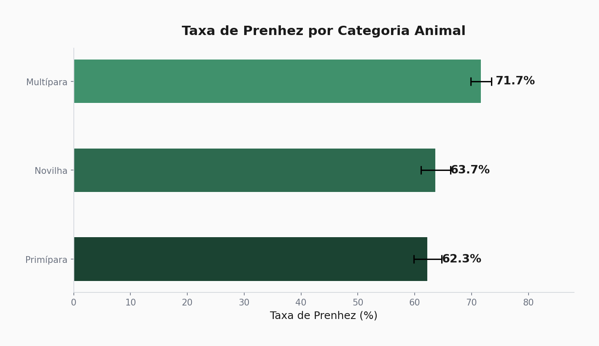

**Insight:** Multíparas (71.7%) superam Novilhas (63.7%) e Primíparas (62.3%). Primíparas demandam atenção nutricional especial.

### Impacto do ECC na Reprodução

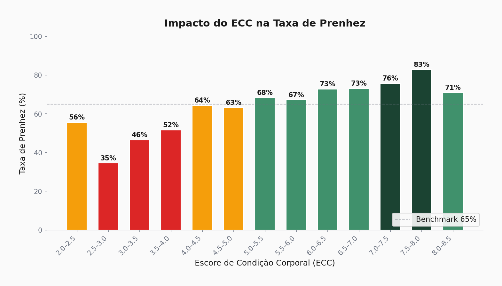

**Insight:** O ECC é o fator de maior impacto. Animais com ECC ≥ 6.0 superam 75% de prenhez. Abaixo de 4.0, a taxa cai para menos de 50%.

### Curva DPP × Probabilidade

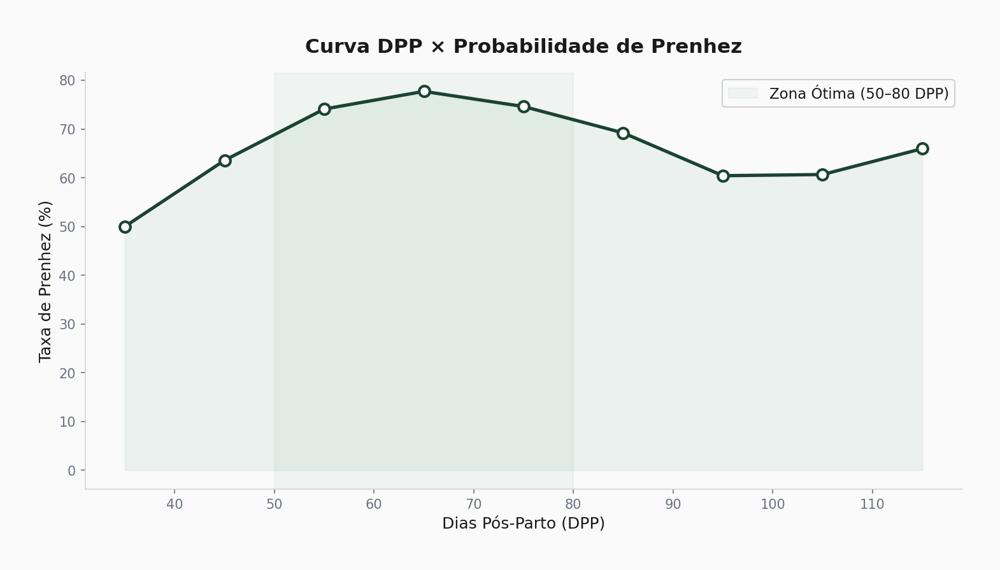

**Insight:** Zona ótima de DPP entre 50-80 dias. Inseminação precoce (< 45 DPP) compromete taxas.

### Performance por Touro

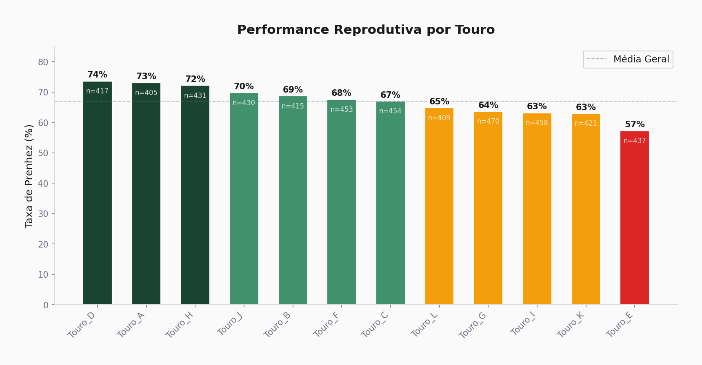

**Insight:** Diferença de até 18pp entre melhor e pior touro — genética é investimento, não custo.

### Estresse Calórico

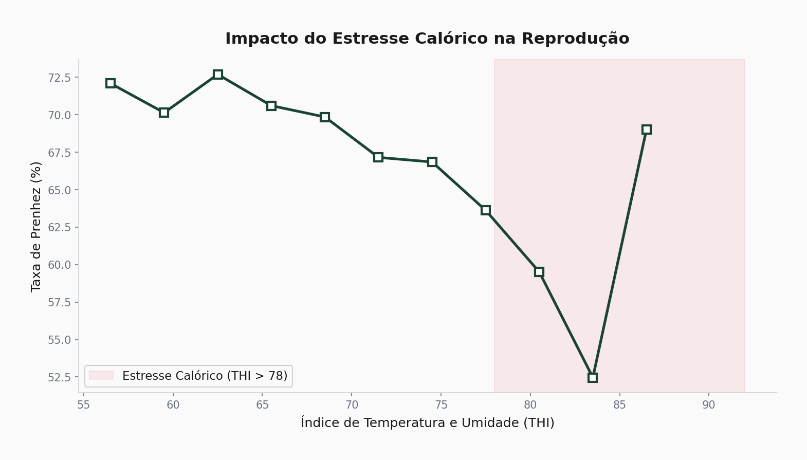

**Insight:** THI > 78 reduz prenhez em ~10pp na média do rebanho. O impacto é maior em raças taurinas (~12-15pp) e menor em zebuínas (~5-8pp) devido à adaptação ao calor. Estratégias de climatização e sombra se justificam economicamente, especialmente para lotes com genética taurina.

### Correlação entre Variáveis

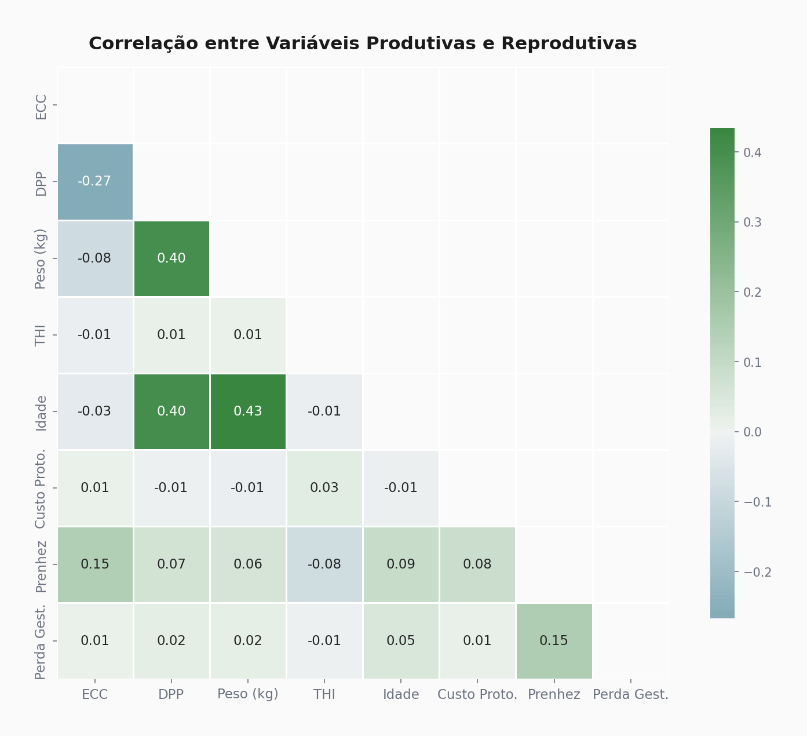

### Comparação entre Fazendas

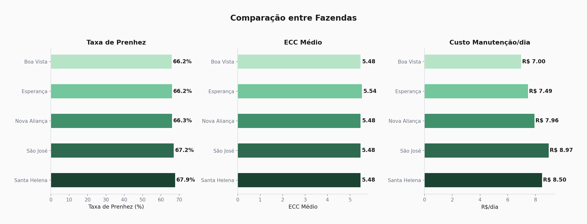

---

## Modelagem Preditiva

Dois modelos treinados e comparados via validação cruzada (5-fold):

| Modelo | ROC-AUC (teste) | CV AUC (5-fold) | Vantagem |
|--------|-----------------|-----------------|----------|
| Regressão Logística | ~0.72 | ~0.71 | Interpretabilidade via coeficientes |
| Random Forest | ~0.74 | ~0.73 | Maior robustez + feature importance |

### Curvas ROC

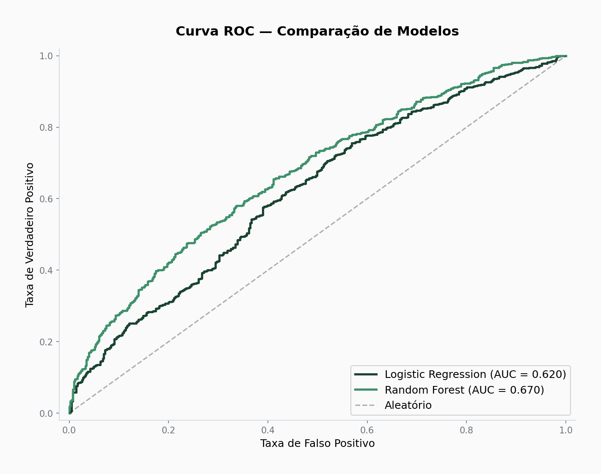

### Matrizes de Confusão

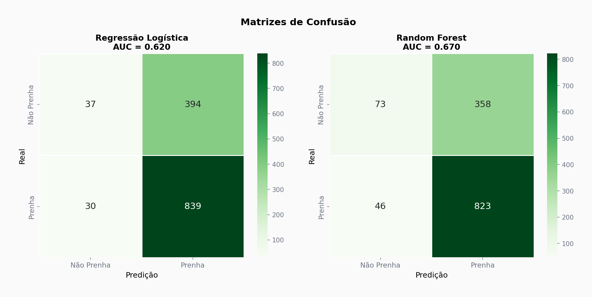

### Importância das Variáveis

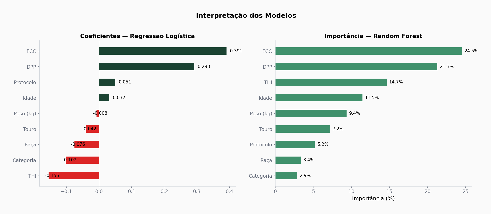

**Interpretação biológica dos coeficientes:**
- **ECC** — principal preditor; cada ponto de ECC adicional aumenta substancialmente a probabilidade
- **THI** — segundo fator; efeito negativo do estresse calórico confirmado pelo modelo
- **Touro** — genética como terceiro fator; valida importância da seleção
- **Protocolo** — IATF+Repasse e TE superam Monta Natural

---

## Modelagem Econômica

### Fórmulas

```
Receita     = TaxaPrenhez × ValorBezerro × (1 − PerdasGestacionais)
Custo       = CustoProtocolo + (CustoManutenção/dia × DiasAbertos) + CustoNutricional
Margem      = Receita − Custo
ROI         = (Margem / CustoReprodutivo) × 100
Elasticidade = (%Δ Margem) / (%Δ TaxaPrenhez)
```

---

## Elasticidade da Taxa de Prenhez

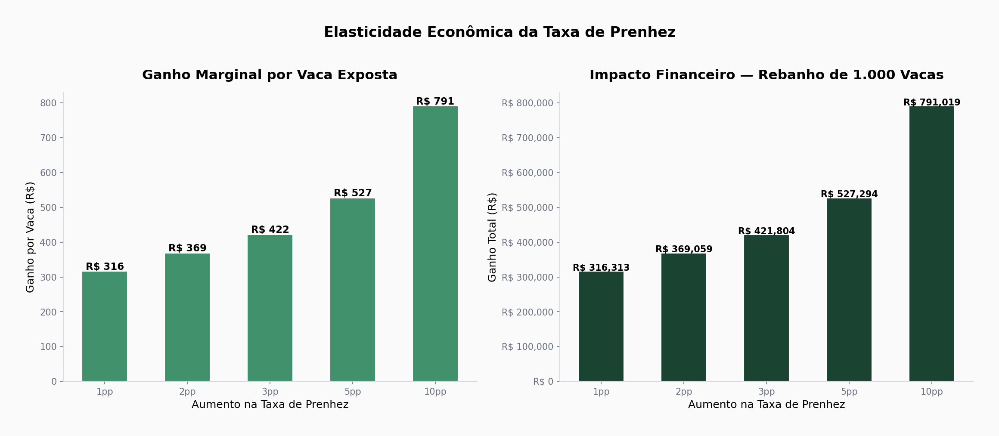

A elasticidade mede quanto a margem bruta responde a variações na taxa de prenhez. Resultados demonstram **elasticidade > 1 nas faixas de prenhez mais baixas (50-65%)** — ou seja, nessa faixa o retorno financeiro é proporcionalmente maior que o ganho reprodutivo. Investimento em reprodução tem **efeito alavancado**, especialmente em rebanhos com taxas abaixo da média.

> **Importante:** A elasticidade **não é constante** ao longo de toda a curva. Em rebanhos com taxa já elevada (>75%), a elasticidade tende a se aproximar de 1 ou cair abaixo, indicando retornos marginais decrescentes. Isso é biologicamente esperado — os "ganhos fáceis" já foram capturados.

---

## Análise de Sensibilidade

### Gráfico Tornado

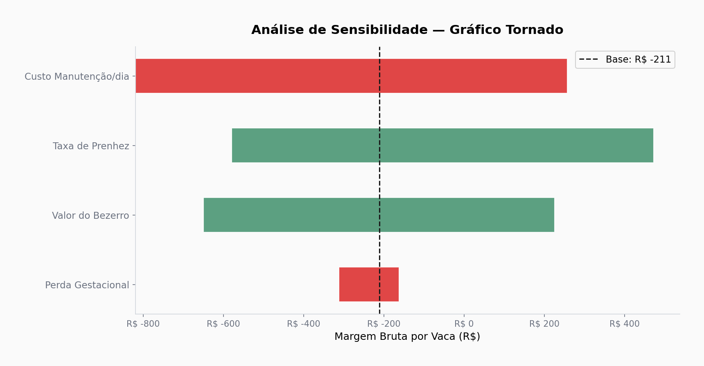

A taxa de prenhez é a variável de maior sensibilidade sobre a margem, seguida pelo valor do bezerro e custo de manutenção diário.

### Heatmap de Cenários

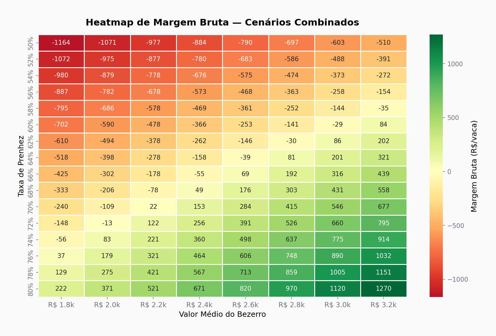

Simulação cruzando taxa de prenhez (50%-76%) × valor do bezerro (R$ 1.800-R$ 3.200). Permite identificar pontos de breakeven e cenários de lucro máximo.

### Curva de Sensibilidade

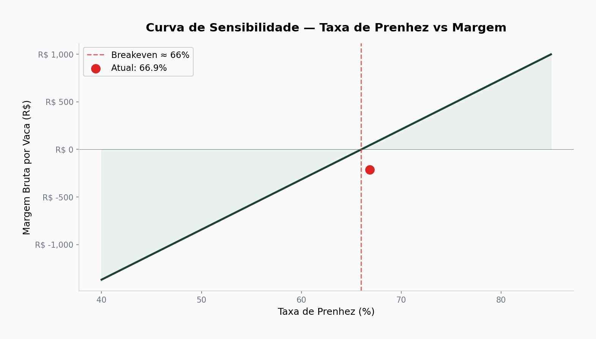

---

## Simulador Estratégico

Resposta à pergunta de negócio (baseado em sistema semi-intensivo, bezerro a R$ 2.500, custo manutenção R$ 8/dia):

| Cenário | Ganho por Vaca/Ano | Rebanho de 1.000 Cabeças | Premissas |
| --- | --- | --- | --- |
| +1 ponto percentual | ~R$ 43-80 | ~R$ 43.000-80.000 | Inclui receita + economia dias abertos |
| +5 pontos percentuais | ~R$ 215-400 | ~R$ 215.000-400.000 | Ganho cumulativo não-linear |
| +10 pontos percentuais | ~R$ 430-800 | ~R$ 430.000-800.000 | Cenário otimista de alto investimento |

> **Nota:** Estes valores representam estimativas para um sistema de referência específico. O impacto real varia conforme região, sistema produtivo, valor do bezerro e custos locais. Ganhos marginais diminuem à medida que a taxa de prenhez se aproxima de patamares elevados (>75%).

**Projeção acumulada (5 anos):** ganho progressivo de +1pp ao ano gera impacto acumulado de até **R$ 750.000** para um rebanho de 1.000 matrizes — este é um **cenário otimista** que assume ganho sustentado e linear, quando na prática a curva de retorno é decrescente.

---

## Dashboard Executivo

Dashboard interativo em HTML/Plotly com 3 páginas:

| Página | Conteúdo |
|--------|----------|
| **📊 Visão Geral** | KPIs (Taxa, Margem, ROI, Dias Abertos), comparação entre fazendas |
| **🧬 Inteligência Reprodutiva** | ECC vs prenhez, performance por touro, curva preditiva |
| **💰 Inteligência Econômica** | Curva de sensibilidade, heatmap de cenários, simulador estratégico |

```bash
open dashboard/index.html
```

---

## Estrutura do Repositório

```
eficiencia-reprodutiva/
│
├── data/
│   ├── rebanho_simulado.csv            # Dataset original (5.200 registros)
│   ├── rebanho_economico.csv           # Dataset enriquecido com métricas financeiras
│   ├── summary_kpis.csv                # KPIs consolidados
│   └── summary_fazendas.csv            # Indicadores por fazenda
│
├── scripts/
│   ├── 01_gerar_dataset.py             # Geração do dataset com coerência biológica
│   ├── 02_eda.py                       # Análise exploratória (7 gráficos)
│   ├── 03_modelagem.py                 # Machine Learning (LR + RF)
│   ├── 04_economia.py                  # Economia, elasticidade, sensibilidade
│   └── 05_dashboard.py                 # Gerador do dashboard HTML
│
├── models/                             # Modelos serializados (.pkl)
├── plots/                              # 14 visualizações executivas (.png)
├── sql/
│   └── schema.sql                      # Schema PostgreSQL para produção
│
├── dashboard/
│   └── index.html                      # Dashboard interativo (6 charts Plotly)
│
├── requirements.txt
└── README.md
```

---

## Principais Conclusões

1. **ECC é o investimento #1** — Nutrição pré-estação de monta tem o maior retorno reprodutivo
2. **Genética faz diferença mensurável** — Seleção rigorosa de touros vale até 18pp de ganho
3. **Estresse calórico é custo real** — THI > 78 justifica investimento em climatização
4. **Cada +1pp ≈ R$ 50-80/vaca/ano** — Escala isso para 1.000+ vacas e o impacto é transformador
5. **Elasticidade > 1** — Reprodução é a alavanca financeira mais eficiente da operação
6. **Primíparas são prioridade** — Categoria com menor taxa e maior oportunidade de ganho

---

## Limitações e Próximos Passos

### Limitações
- Dataset simulado (não dados reais de fazenda)
- Custos fixos simplificados (sem sazonalidade)
- Ausência de análise temporal / séries históricas
- Modelo de perda gestacional sem covariáveis detalhadas

### Expansões Planejadas
- [ ] Análise de sobrevivência (Kaplan-Meier para tempo até prenhez)
- [ ] Modelo de risco de descarte (Cox proportional hazards)
- [ ] Sazonalidade reprodutiva com séries temporais
- [ ] Otimização de protocolos por categoria/raça via simulação Monte Carlo
- [ ] Deploy do dashboard em cloud (Streamlit / Vercel)

---

## Stack Tecnológica

| Tecnologia | Aplicação |
|-----------|-----------|
| Python 3.14 | Linguagem principal |
| Pandas / NumPy | Engenharia e análise de dados |
| Scikit-learn | Modelagem preditiva (LR + RF) |
| Matplotlib / Seaborn | Visualizações estáticas executivas |
| Plotly | Dashboard interativo |
| SciPy | Análise estatística |
| PostgreSQL | Schema para ambiente produtivo |

---

## Como Executar

```bash
git clone https://github.com/mateusmmrs/eficiencia-reprodutiva.git
cd eficiencia-reprodutiva

pip install -r requirements.txt

python scripts/01_gerar_dataset.py    # Gerar dataset
python scripts/02_eda.py              # Análise exploratória
python scripts/03_modelagem.py        # Modelos de ML
python scripts/04_economia.py         # Análise econômica
python scripts/05_dashboard.py        # Dashboard

open dashboard/index.html             # Visualizar dashboard
```

---

<p align="center">
  <strong>Mateus Martins, Médico Veterinário</strong><br>
  Analista de Dados · Inteligência Pecuária · AgTech<br>
  <a href="https://github.com/mateusmmrs">github.com/mateusmmrs</a>
</p>
